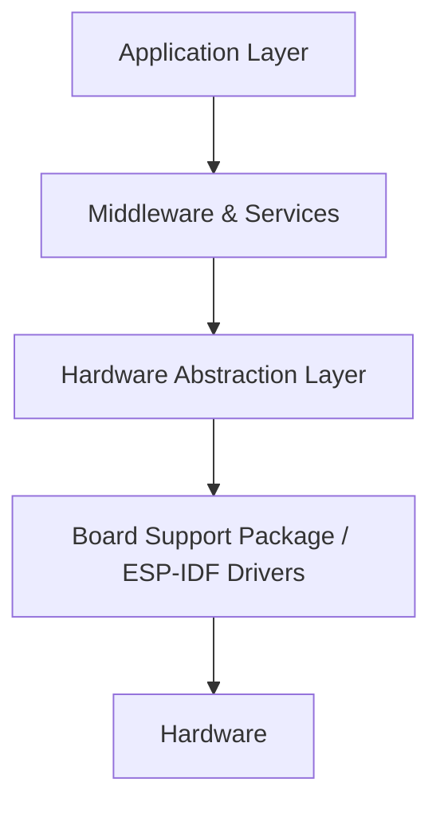

# AgriNetPro System Architecture

## 1. Introduction

This document outlines the high-level embedded software architecture for the AgriNetPro system, which comprises an **IoT Gateway** (Dual-SoC: ESP32-S3 Host + ESP32-H2 RCP) and multiple ultra-low-power **IoT Nodes** (ESP32-H2).
 The system is built on **ESP-IDF** (FreeRTOS) and is designed for industrial deployment, emphasizing modularity, testability, and reliability.

### 1.1 Dual-SoC Gateway Architecture
To ensure high-performance Wi-Fi and Zigbee coexistence, the Gateway uses:
*   **Host (ESP32-S3)**: Handles application logic, Wi-Fi connectivity, MQTT, and the Zigbee Host stack.
*   **Radio Co-Processor (ESP32-H2)**: Dedicated 802.15.4 radio handling the lower-level Zigbee/Thread stack.
*   **Inter-SoC Link**: High-speed UART with flow control.

## 2. Architectural Principles

To ensure maintainability and portability, the software strictly follows a **Layered Architecture**:

### 2.1 Layer Definitions
*   **Application Layer**: Contains business logic (e.g., Sensor data aggregation, Rule execution, Cloud communication mapping).
*   **Middleware & Services Layer**: Reusable components such as Network Management (Wi-Fi, Zigbee, Thread), OTA handling, Security (TLS, NVS Encryption), and Inter-Task Communication.
*   **Hardware Abstraction Layer (HAL)**: Interfaces defining hardware interactions (`uart_read`, `gpio_set`, `i2c_write`). This decouples the core logic from specific ESP-IDF API calls, allowing for unit testing using mocks.

## 3. RTOS Design & Task Management

The system utilizes **FreeRTOS** for deterministic multi-tasking.

### 3.1 Inter-Process Communication (IPC)
Modules must not call each other's functions directly if they operate in different task contexts to prevent race conditions. Instead, they use:
1.  **Event Loops (esp_event)**: For system-wide asynchronous events (e.g., `WIFI_CONNECTED`, `ZIGBEE_NODE_JOINED`).
2.  **Message Queues**: For passing structured data between tasks (e.g., sending sensor payloads from the Radio Task to the MQTT Task).

### 3.2 Task Priority Guidelines
*   **High Priority (Real-Time)**: Hardware interrupts (ISRs), Radio Stacks (Wi-Fi/Bluetooth/Zigbee handled natively by ESP-IDF).
*   **Medium Priority**: Sensor data acquisition, Command processing, Control loops.
*   **Low Priority**: OTA Updates, Background Diagnostics, Logging.

## 4. Security Architecture

Industrial grade security is implemented at multiple levels:
*   **Secure Boot V2**: Prevents execution of unauthorized firmware. Only images signed with the company's private key will boot.
*   **Flash Encryption**: Protects intellectual property and sensitive credentials stored in flash memory.
*   **Encrypted Storage (NVS)**: Wi-Fi credentials, Device Certificates, and API keys are stored in an encrypted NVS partition.
*   **Transport Security**: All external IP communications use TLS 1.2/1.3 with mutual authentication (mTLS) where applicable.

## 5. Over-The-Air (OTA) Updates

The system employs a robust A/B partition scheme for seamless and safe updates.
*   **Partitions**: `factory`, `ota_0`, `ota_1`.
*   **Rollback Protection**: After an update, the new firmware must explicitly mark itself as "valid" after successfully connecting to the network. If it crashes or fails to connect, the bootloader automatically reverts to the previous working partition.
